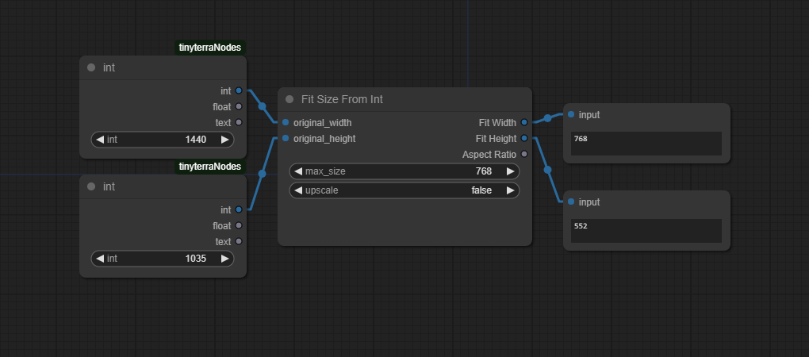
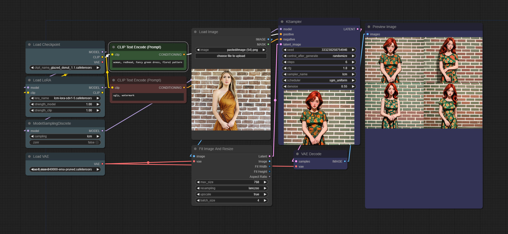

# Comfy Fit Size

A simple set of nodes for making an image fit within a bounding box

## Contents

- [Installation](#installation)
- [Nodes](#nodes)
    - [Fit Size From Int](#fit-size-from-int)
    - [Fit Size From Image](#fit-size-from-image)
    - [Fit Image And Resize](#fit-image-and-resize)
    - [Load Image And Resize To Fit](#load-image-and-resize-to-fit)
- [Values](#values)
    - [Input](#input)
    - [Output](#output)

## Installation

To install this node, open your `custom_nodes` folder in a terminal and clone this project into it.

`git clone https://github.com/bronkula/comfyui-fitsize.git`

## Nodes

There are currently a few different nodes that are all based around fitting content within a bounding box. The reasoning behind this is that I like to copy screengrab content into comfyui, and I don't want to worry about what size or aspect ratio it is. I want it to automatically be fit to something appropriate.

These nodes will automatically fudge the sizes to fit within increments of 8, so that the output image sizes will be more palatable to Stable Diffusion. They should all be able to upscale or downscale whatever input they're given.

### Fit Size From Int

This node is the most basic. It's the basic math of fitting some content within a bounding box. Give it a width, height, and max size, and it will scale the sizes to fit in the max size.

Obviously you can also change the inputs to accept values from outside.

### Fit Size From Image

This node accepts any image input and will extract the width and height automatically. All of these nodes can be told to upscale or not. The normal use of these nodes is to reduce a size down to something reasonable, but if upscale is true than it will also try to increase the size to the max_size.

### Fit Image And Resize

Now this is where things get interesting. This node accepts a vae so that we can skip right to outputting a rescaled image. It will output both an image and a latent batch. This makes it a very useful tool for img2img workflows. 

Because the node now outputs a latent batch based on the original image, img2img workflows are much easier. Simply reduce the denoise in the ksampler to somewhere around `0.5`. Anything less will be more like the original image, and anything more will start to deviate wildly.

### Load Image And Resize To Fit

But I decided that I wanted to just add in the image handling completely into one node, so that's what this one is. It has built in image handling compeletely. You can copy and paste image data directly into it, just like the default comfyui node. You don't have to save an image, just paste it in.

This workflow uses a number of other custom node sets to showcase that this node works great in the middle of a workflow.

Here is a simpler workflow example using the Efficiency nodes. The Fit nodes should fit right into the middle of a lot of other workflows.

## Values

#### Input
- **vae** - This value will be a loaded vae from a previous node
- **image** - This value will be a string of a file location
- **max_size** - This value will be an integer of the largest size you want to rescale to for width or height
- **resampling** - This value will be the resampling method `[lanczos,nearest,bilinear,bicubic]`
- **upscale** - This value is true or false, if true small images will be upscaled to the max_size
- **batch_size** - This value is an integer, default is 1 while any number higher will control batch processing down the line
- **add_noise** - This value is a float, default is 0 while any number up to 1.0 will add noise to the image

#### Output
- **latent** - A latent batch of images
- **image** - The newly resized image not vae encoded
- **width** - The newly resized width
- **height** - The newly resized height
- **aspect ratio** - The aspect ratio of the width and height
- **mask** - A mask output from loading an image and using the mask editor

## Author

Hamilton Cline https://hdraws.com

## Checkpoints

- [Sugar Donut](https://civitai.com/models/161043/sugar-donut)
- [Jelly Donut](https://civitai.com/models/156381/jelly-donut)
- [Glazed Donut](https://civitai.com/models/187195/glazed-donut)