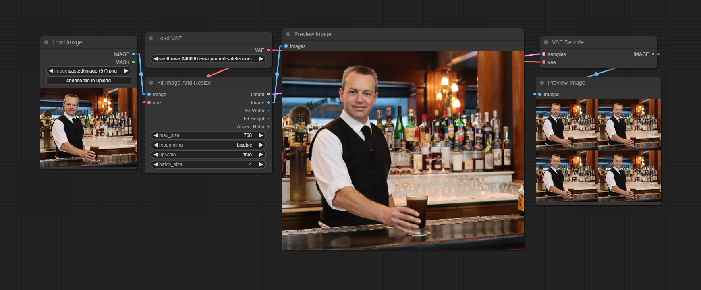

# Comfy Fit Size

A simple set of nodes for making an image fit within a bounding box

## Nodes

There are currently a few different nodes that are all based around fitting content within a bounding box. The reasoning behind this is that I like to copy screengrab content into comfyui, and I don't want to worry about what size or aspect ratio it is. I want it to automatically be fit to something appropriate.

### Fit Size From Int

This node is the most basic. It's the basic math of fitting some content within a bounding box. Give it a width, height, and max size, and it will scale the sizes to fit in the max size.

Obviously you can also change the inputs to accept values from outside.

### Fit Size From Image

This node accepts any image input and will extract the width and height automatically. All of these nodes can be told to upscale or not. The normal use of these nodes is to reduce a size down to something reasonable, but if upscale is true than it will also try to increase the size to the max_size.

### Fit Resize Image

Now this is where things get interesting. This node accepts a vae so that we can skip right to outputting a rescaled image. It will output both an image and a latent batch. This makes it a very useful tool for img2img workflows. 

## Author

Hamilton Cline https://hdraws.com